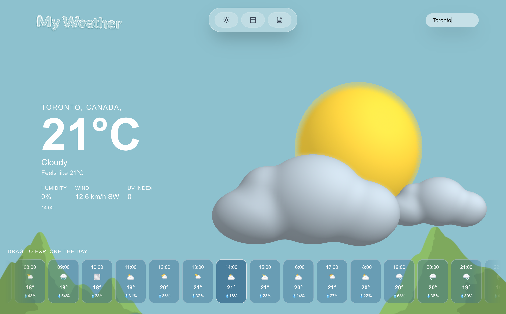

# My Weather

An interactive weather app with 3D animated scenes. It shows current conditions, an hour-by-hour forecast for today and a weekly outlook for any city, or for your current location.

**Live demo:** [weather-gamma-blue.vercel.app](https://weather-gamma-blue.vercel.app/)



## Features

- **Current weather**: temperature, conditions, feels-like, humidity, wind and UV index.
- **Daily forecast**: drag the hourly strip to explore the day; the details update for the selected hour.
- **Weekly forecast**: a 7-day outlook.
- **Location detection**: type a city, or let the app use your browser's geolocation (with an IP-based fallback).
- **3D scenes**: animated Spline scenes that match the weather.
- **English / Spanish**: picks your browser's language and remembers your choice.

## Tech stack

- [Next.js 16](https://nextjs.org) (App Router) + React 19 + TypeScript
- [Tailwind CSS 4](https://tailwindcss.com)
- [Spline](https://spline.design) for 3D scenes
- [Framer Motion](https://www.framer.com/motion/) and [GSAP](https://gsap.com) for animation
- [WeatherAPI.com](https://www.weatherapi.com) for weather data
- Deployed on [Vercel](https://vercel.com)

## Getting started

1. Install dependencies:

   ```bash
   npm install
   ```

2. Create a `.env.local` file with your [WeatherAPI](https://www.weatherapi.com) key:

   ```bash
   NEXT_PUBLIC_WEATHER_API_KEY=your_api_key_here
   ```

3. Run the development server:

   ```bash
   npm run dev
   ```

4. Open [http://localhost:3000](http://localhost:3000).

## Project structure

```
app/
├── page.tsx              # Current weather (home)
├── forecast/day/         # Hourly forecast for today
├── forecast/week/        # 7-day forecast
├── about/                # About page
├── components/           # Menu, footer, title, 3D weather scene
└── lib/                  # i18n and location helpers
```

## Deployment

Deployed on Vercel at **https://weather-gamma-blue.vercel.app/**. To deploy your own copy, import the repo into Vercel and add `NEXT_PUBLIC_WEATHER_API_KEY` as an environment variable.
